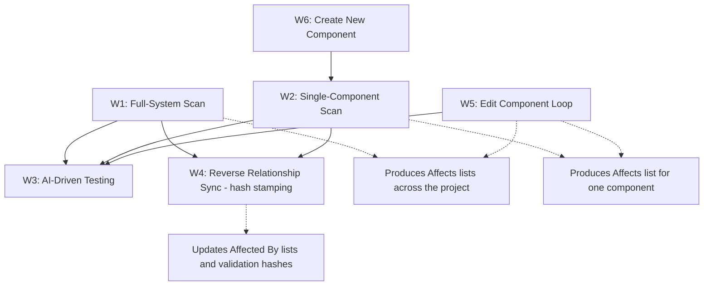
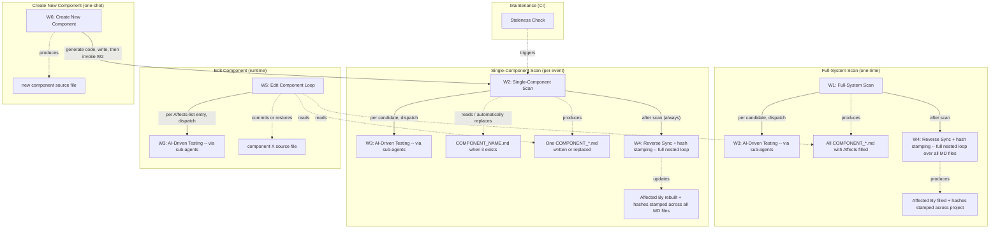

# Workflows — Component Impact Discovery

> The six workflows that produce, maintain, and consume the `COMPONENT_<name>.md` files in this proposal.
>
> This document specifies each workflow at the algorithm level — inputs, outputs, edge cases, parallelization. It does not specify a particular runner. Any compliant runner (Claude Code custom commands, Codex workflows, a custom Python orchestrator driving an LLM API) that implements these algorithms is acceptable. Where the AI's behavior is intentionally under-specified (specifically in Workflow 3), the spec says so explicitly — the under-specification is the design.

## 0. Workflow overview

| # | Workflow | Purpose | Cost shape | When it runs |
|---|---|---|---|---|
| 1 | **Full-System Impact Scan** | Iterate every component; mutate; delegate testing to W3; write `Affects` lists | `O(N × M × T)` with sub-agent parallelism reducing wall time | Once, at project setup; on demand for full re-scan |
| 2 | **Single-Component Impact Scan** | Works on exactly one component that you hand it — the same mutation + test-all algorithm as Workflow 1, **minus the outer loop**. It mutates that component, tests **every** other component in the system, determines who the component affects and who it is affected by, and writes the component's MD file. If a `COMPONENT_<NAME>.md` already exists under that component's name, the fresh scan result **automatically replaces** it (the previous version is preserved in git history); if none exists, W2 creates one. W2 then invokes W4. | `O(M × (N−1) × T / P)` | On revalidation / on demand; on new component via W6 |
| 3 | **AI-Driven Testing** | Given a (component-under-test, mutation-context) task, dynamically determine and execute appropriate tests; return pass/fail + impact evidence | Proportional to component surface + AI's selected test count | Invoked by W1, W2, and W5, typically via parallel sub-agents |
| 4 | **Reverse Relationship Sync** | Propagate `Affected By:` entries by rebuilding them from all `Affects:` lists (always a full nested loop over every MD file); **stamp the validation hash (`last_validated`) into the MD file of every component** — W4 is the sole writer of that hash | `O(N² × L)` file reads; pure file I/O, zero LLM calls | After W1, W2  , W6 (via W2) complete and can be after W5 |
| 5 | **Edit Component Loop** | Take an edit prompt for component X, back up X's source, apply the edit, fan out parallel W3 sub-agents against every component under X's `Affects:` headline; on any `affected` verdict, cancel the rest, restore the original, retry with a different edit; loop until safe or max-retries hit | `O(R × |Affects(X)| × T / P)` where R = retries, P = sub-agent fan-out | Whenever the agent modifies an existing component; on demand for edit verification |
| 6 | **Create New Component** | Take a creation prompt, generate the new component's source code, write it to disk, then invoke Workflow 2 on the new component — no MD exists under its name yet, so W2 creates one (it would automatically replace an existing MD if one existed). W2 internally triggers Workflow 4 to propagate reverse edges and stamp the validation hashes. | `O(codegen) + O(M × (N−1) × T / P)` (the Workflow 2 cost) | Whenever a new component is created; on demand for end-to-end new-component bootstrap |

Where:
- `N` = number of components in the project.
- `M` = average number of mutation operators applied per component (typically 4–10; see §1.5 for the operator catalog).
- `T` = AI-driven testing time per component — the time Workflow 3 takes to dynamically select and execute appropriate tests for one component-under-test, given a mutation context.
- `R` = retry count in the Workflow 5 edit loop (default 3).
- `|Affects(X)|` = number of components listed under X's `Affects:` headline.
- `P` = parallel sub-agent fan-out factor (typically 4–16, bounded by LLM API rate limits and test-runner concurrency limits).



Workflows 1 and 2 are the primary discovery loops. They run the same mutation + test-all algorithm; the only difference is the outer loop: Workflow 1 wraps the algorithm in an outer loop over every component in the project, while Workflow 2 has no outer loop and runs it on the single component you hand it. Workflow 2 mutates that component, tests every other component in the system, and writes its MD — automatically replacing an existing `COMPONENT_<NAME>.md` if one exists under that name, or creating a new one if not. Workflow 3 is the testing engine they hand off to. Workflow 4 is the bookkeeping step that keeps the relationships stored in the COMPONENT_*.md files consistent in both directions, and it is the workflow responsible for stamping the validation hash into the MD file of every component. Workflow 5 is the runtime edit-and-verify loop that *consumes* the relationships stored in the COMPONENT_*.md files — it reads the Affects list, applies the edit, and verifies via Workflow 3; it has **no relation to Workflow 2** and never invokes it. Workflow 6 wraps code generation with W2 + W4 (W2 triggers W4 internally) so that new components are documented as soon as they're written.

## 1. Workflow 1 — Full-System Impact Scan

### 1.1 Purpose

Build the complete set of `Affects` relationships for an existing project, from scratch. There is no central graph — the output is a fully populated `COMPONENT_<name>.md` for every component, with Affects lists populated. Workflow 4 then fills every Affected By list and stamps the validation hash by scanning all MD files.

### 1.2 Conceptual model

For every component X in the project, Workflow 1 intentionally modifies X (the modification does not have to be a simple syntax error — it can change syntax, implementation, logic, behavior, or functionality), then asks: *which other components are affected by this change?* The workflow does not answer this question itself. Instead, it creates a testing task for each candidate-affected component and hands those tasks to Workflow 3.

This is a critical distinction. Workflow 1's job is to decide **which components need to be tested** — not how to test them. Workflow 3's job is to decide **how to test a given component** — not which components to test. Keeping these responsibilities separate is what allows the documentation to remain agnostic of the test inventory.

If Workflow 3's results show that components A, C, and D were affected by the modification of X, Workflow 1 has discovered the relationship: `X affects A, C, D`. That relationship is written into X's doc as the `Affects` list. Workflow 4 then writes the reverse direction (`Affected By: X`) into A, C, and D's docs.

Conceptually, this is a nested loop: every component is mutated, and for each mutation the suspected-affected components are tested. The system discovers actual behavioral dependencies through this loop, rather than assuming that a code-level import implies a behavioral dependency.

### 1.3 Inputs

- The codebase at a known git commit (recorded for `provenance`).
- The component inventory — a list of `(name, primary source file path)` pairs. If not provided, the workflow runs a discovery heuristic first (any file containing a class, module, or function definition with at least one external consumer).
- An AI orchestration layer capable of: (a) applying mutations to source files, (b) dispatching parallel sub-agents to Workflow 3, (c) reading their results, (d) restoring mutated files from backup.
- Access to the project's test runner (for Workflow 3's internal use). The test runner must support running individual tests, subsets, or the full suite.

### 1.4 Outputs

For each component X, a populated `COMPONENT_<X>.md` containing:
- All required fields per [`SPEC.md` §3](./SPEC.md).
- `Affects` derived from Workflow 3's verdicts — for each mutation applied to X, the set of components Y where Workflow 3 reported that Y's behavior was affected.
- `Affected By` populated by Workflow 4 after W1 completes (initially empty in W1's own output).
- `provenance` recording: workflow ID (1), git commit, mutation operators used, approximate token cost, sub-agent fan-out factor.

Plus the complete set of `COMPONENT_*.md` files capturing the bidirectional edges discovered. There is **no central graph artifact** — the relationships live only in the distributed per-component MD files. This set of files is what Workflow 2 reads when scanning a component, and the substrate Workflow 4 reads from when synchronizing reverse edges and stamping hashes.

### 1.5 Mutation operator catalog

Both Workflow 1 and Workflow 2 mutate components to discover impact. The catalog of mutations is language-specific and intentionally small — the goal is to perturb the component's behavior in characteristic ways, not to exhaustively enumerate every possible defect.

The required operator set (all languages):

- **`SIGNATURE_CHANGE`** — change a public function/method's signature. Add a required parameter, change a parameter type, or change the return type. Discovers consumers that will fail to compile or that pass wrong arguments.
- **`RETURN_VALUE_CORRUPTION`** — replace a public function's return value with a sentinel (null, zero, empty string, default-constructed object). Discovers consumers that depend on the actual return value.
- **`EXCEPTION_INJECTION`** — make a public function throw an exception where it previously did not. Discovers consumers that lack exception handling.
- **`BEHAVIOR_SWAP`** — replace a public function's body with a logically opposite behavior (e.g. `if (x) return A; else return B;` becomes `if (x) return B; else return A;`). Discovers consumers that depend on the function's behavior beyond its return type.

Optional operators (language-specific):

- **`ASYNCNESS_CHANGE`** (languages with async) — convert a sync function to async or vice versa. Discovers consumers that assume a particular execution model.
- **`NULLABILITY_FLIP`** (languages with nullability annotations) — change a parameter or return type's nullability. Discovers consumers that assume null safety.
- **`VISIBILITY_CHANGE`** — change a symbol from public to private. Discovers consumers that depend on visibility.
- **`REMOVAL`** — delete a public symbol entirely. Most aggressive; use sparingly because it triggers compile errors rather than runtime test failures, which can mask downstream impact. Often equivalent to `SIGNATURE_CHANGE` for impact-discovery purposes.

Operator selection: for a component with K public symbols, the workflow SHOULD apply one operator per public symbol (default: `RETURN_VALUE_CORRUPTION`, which produces the cleanest runtime signal). Applying all operators to all symbols is `O(K × 4)` mutations; for most components, K is 1–5, so the total mutations are 4–20, which is manageable. The workflow SHOULD prefer runtime-affecting operators (`RETURN_VALUE_CORRUPTION`, `BEHAVIOR_SWAP`) over compile-affecting ones (`SIGNATURE_CHANGE`, `REMOVAL`) when the goal is impact discovery rather than breakage testing, because compile errors stop the test suite before downstream tests run and mask the impact signal.

 The workflow ( W1 or W2 ) can also be implemented by delegating operator selection to the agent, allowing the agent to select the appropriate mutation operator on the fly based on the target component (but this is exception ) .
 
## By default, the set must contain at least one operator.

### 1.6 Algorithm

```text
WORKFLOW 1 — FULL-SYSTEM IMPACT SCAN

INPUT:  codebase at commit C
        component inventory I = [(name_1, path_1), ..., (name_N, path_N)]

OUTPUT: COMPONENT_<name_i>.md for each i
        COMPONENT_*.md files (bidirectional edges)
        progress.json (resumability state)

STEPS:

  1. RECORD start_time, token_counter := 0
  2. INITIALIZE empty collection of discovered edges (to be written into COMPONENT_*.md files)
  3. RECORD baseline test state for the project (run all tests once
     on the unmutated codebase; record tests_pass_baseline).
     This catches pre-existing failures and prevents them from
     polluting the impact signal.

  4. FOR each component X in I:
       4.1  SAVE original source of X to .scan/originals/<X>.bak
       4.2  IDENTIFY mutation operators applicable to X
            (see §1.5). Select a subset: at minimum, one mutation
            per public symbol exported by X.

       4.3  FOR each mutation operator M selected:
              4.3.1  APPLY M to X (in working copy)
              4.3.2  CANDIDATES := components in I other than X
                     (optionally filtered by a pre-filter:
                     shared imports, shared test directories,
                     or static call-edge proximity).
              4.3.3  FOR each candidate Y in CANDIDATES:
                       CREATE testing task:
                         (component_under_test=Y,
                          mutation_context=(X, M),
                          baseline=tests_pass_baseline)
                       ENQUEUE task for Workflow 3.
              4.3.4  DISPATCH tasks to Workflow 3, optionally
                     fanned out across parallel sub-agents
                     (see §1.7 Parallelization).
              4.3.5  COLLECT verdicts from sub-agents:
                       for each task, Workflow 3 returns:
                         (Y, affected=True|False, evidence=...)
              4.3.6  FOR each Y where affected=True:
                       RECORD edge (X --M--> Y) for later writing into X's Affects list
              4.3.7  RESTORE X from .scan/originals/<X>.bak
              4.3.8  INCREMENT token_counter by sub-agents' reported
                     cost for this iteration.

       4.4  POPULATE COMPONENT_<X>.md:
              component       := X.name
              location        := X.path
              last_validated  := (left untouched here — stamped
                                 into every MD file by the Workflow 4
                                 run at step 5)
              Affects         := unique set of Y where any edge
                                 (X --M--> Y) was recorded
              Affected By     := []  (filled by Workflow 4)
              provenance      := workflow_id=1, commit=C,
                                 operators=[M1, M2, ...],
                                 tokens=token_counter_for_X,
                                 sub_agent_fan_out=P_X

       4.5  WRITE COMPONENT_<X>.md
       4.6  PERSIST COMPONENT_*.md files + progress.json (checkpoint)

  5. INVOKE Workflow 4 (Reverse Relationship Sync) on the
     complete set of COMPONENT_*.md files. Workflow 4 writes the
     Affected_By sections into every component's doc and stamps
     the validation hash (commit C) into the MD file of every
     component — W4 is the sole writer of last_validated.

  6. EMIT summary: components processed, total token cost,
     operators applied, components with empty Affects
     (flag for review), sub-agent fan-out achieved.

  7. RETURN
```

### 1.7 Parallelization

The testing tasks created in step 4.3.3 do not need to be executed sequentially. The workflow can dispatch them to multiple sub-agents in parallel, where each sub-agent independently invokes Workflow 3 against its assigned candidate component.

```text
                 Component X (mutated)
                      |
          -------------------------
          |    |    |    |    |   |
        Agent Agent Agent Agent Agent Agent
          |    |    |    |    |   |
          A    B    C    D    E   F
```

Each sub-agent receives a `(component_under_test, mutation_context, baseline)` task and returns a `(affected, evidence)` verdict. The orchestrator merges the verdicts and continues. The only serialization point is `COMPONENT_*.md files`, which can be merged from per-iteration fragments after each mutation completes.

Practical parallelism is bounded by:
- LLM API rate limits (each sub-agent makes API calls for code understanding and test selection).
- Test-runner concurrency limits (most test suites don't tolerate concurrent execution against shared state — databases, ports, filesystem race conditions).
- Available compute (sub-agents may share a checkout or each use their own git worktree).

A reasonable target: dispatch candidate testing in batches of P = min(N/4, API_rate_limit) parallel sub-agents, where N is the number of candidates. This typically yields a 4× wall-time speedup. Larger fan-out is possible when the test suite tolerates concurrent execution (e.g. when each component's tests are isolated to their own directory and the test runner supports parallel process isolation).

### 1.8 Complexity and cost

The outer loop runs N times. The inner loop runs once per selected mutation operator per component (typically 3–10 mutations depending on the component's public surface). For each mutation, C = (N − 1) candidate components are tested by Workflow 3; with P-way parallel sub-agent fan-out, the wall time per mutation is roughly `C/P × T`, where T is Workflow 3's per-component testing time.

Total wall time: `O(N × M × C × T / P)`. For a 500-component project with M = 5 mutations per component, C = 499 candidates (pre-filtered down to ~50 by shared-imports heuristic), T = 10 seconds per AI-driven test, and P = 8 parallel sub-agents: `500 × 5 × 50 × 10s / 8 ≈ 26 hours` of wall time, and a bounded but substantial token budget. See [`COST.md`](./COST.md) for order-of-magnitude estimates and worked examples.

### 1.9 Edge cases

- **Non-deterministic tests** — if Workflow 3's verdict for the same task differs across runs, the impact signal is unreliable. Mitigation: Workflow 3 SHOULD run each candidate test at least twice when the verdict is "affected" and only report a stable edge if the verdict is consistent. Flag the affected test in `provenance` and `notes`.
- **Tests that don't terminate** — mutation may introduce infinite loops. Mitigation: Workflow 3 enforces a per-test timeout (default: 2× the baseline run time); on timeout, treat as "affected" and record.
- **Components with no consumers** — `Affects` will be empty. This is not an error; it is a valid state for utility or entry-point components. Flag in the summary so a human can decide whether the component should be deprecated.
- **Cyclic dependencies** — the workflow will produce cycles in the relationships stored in the COMPONENT_*.md files. This is fine; the relationships are bidirectional. Workflow 4 handles cycles correctly (a component can appear in its own `Affected By` list).
- **Pre-existing failing tests** — the baseline test run at step 3 captures the pre-mutation state. Workflow 3 compares against this baseline; only *newly failing* tests contribute to the "affected" verdict.
- **Mutations that touch many components** — if mutating X causes 50 unrelated components to report "affected," that suggests X is a load-bearing component (or that the test suite is fragile). Either way, record all 50 edges; do not filter.

### 1.10 Resumability

The full-system scan is long-running. It MUST support checkpoint and resume:
- After each component's outer-loop iteration (step 4.6), persist `COMPONENT_*.md files` and a `progress.json` recording which components have been processed.
- On restart, skip already-processed components (unless `--force` is passed).
- On per-iteration failure (sub-agent crash, LLM API error, test-runner timeout), log the failure, continue to the next iteration, and emit a list of failed iterations at the end.

## 2. Workflow 2 — Single-Component Impact Scan

### 2.1 Purpose

Perform an impact scan scoped to one selected component. Workflow 2 is **not** a creation-only workflow — it is the general-purpose single-component scanner. It works on exactly one component that you hand it: it mutates that component, tests **every** other component in the system, determines who the component affects and who it is affected by, and writes the component's MD file.

The only difference between Workflow 2 and Workflow 1 is the outer loop: Workflow 1 iterates over every component in the project; Workflow 2 has no outer loop and processes only the component it is given.

How the MD file is handled:

| MD file for the component? | Behavior |
|------|-------------|
| No `COMPONENT_<NAME>.md` exists | W2 creates a new MD after the scan (e.g. new component via W6). |
| `COMPONENT_<NAME>.md` exists under that name | **Automatic replacement** — the freshly scanned MD fully replaces the existing file. No merge, no diffing; the previous version is preserved in git history. |

Either way, the same mutation + test-all algorithm runs and Workflow 4 is invoked at the end.

Used when a component needs revalidation, when a developer explicitly requests an impact scan for one component, or when Workflow 6 creates a new component.

### 2.2 Conceptual model

Workflow 2 is Workflow 1's inner loop scoped to one component — with the outer loop removed:

1. Identify the target component X (from the component name / source path you hand it, or from the path of its existing `COMPONENT_<NAME>.md`).
2. Mutate X using the operator catalog (§1.5).
3. For each mutation, dispatch Workflow 3 against **every** other component in the inventory (no pre-filter required; optional import-based heuristic allowed).
4. Collect verdicts → build the `Affects` list for X.
5. Write `COMPONENT_<NAME>.md` with the new `Affects` list — automatically replacing the existing file if one exists under that component's name, or creating a new one if not.
6. Invoke Workflow 4 so every `Affected By:` list across the project is rebuilt and the validation hash is stamped into every component's MD file.

There is no check-only / no-mutation mode and no mode flag. Every invocation mutates the target and tests every other component; the only branch point is whether the MD file is created or automatically replaced — the algorithm is identical either way. At the end of the run, the component's MD contains both directions of its relationships: `Affects` (written by W2 from Workflow 3's verdicts) and `Affected By` (rebuilt by the W4 run W2 triggers).

| Workflow | Scope |
| --- | --- |
| Workflow 1 | Entire project (outer loop over every component) |
| Workflow 2 | One component you hand it (no outer loop) — mutate it, test every other component, write / automatically replace its MD |

### 2.3 Inputs

- The codebase at a known git commit.
- The target component: its name and primary source file path, or the path to its existing `COMPONENT_<NAME>.md` (from which the name and location are resolved). The MD file is **not** required — if no MD exists under the component's name, W2 creates one; if one exists, W2 automatically replaces it.
- An AI orchestration layer capable of dispatching parallel sub-agents to Workflow 3.
- The test runner (for Workflow 3's internal use).

### 2.4 Outputs

- A new or **automatically replaced** `COMPONENT_<NAME>.md` with the `Affects` list populated from Workflow 3 verdicts.
- Workflow 4 is invoked after the scan so every `Affected By:` list across the project is rebuilt and the validation hash is stamped into every component's MD file.
- `provenance` records whether an existing MD was automatically replaced (`replaced_existing_md: true|false`).

### 2.5 Algorithm

```text
WORKFLOW 2 — SINGLE-COMPONENT IMPACT SCAN

INPUT:  codebase at commit C
        target component (NAME, PATH) — or the path to an
        existing COMPONENT_<NAME>.md (NAME and PATH are then
        read from that file)

OUTPUT: COMPONENT_<NAME>.md (created, or automatically replaced
        when one already exists under that name)
        (Workflow 4 invoked after the scan: reverse sync + hash
        stamping across every MD file)

STEPS:

  1. RESOLVE the target component:
       1.1  IF the input is a path to COMPONENT_<NAME>.md:
              READ it → confirm NAME and location PATH.
              SET replacement := true
              (the scan result will automatically replace
               this file)
       1.2  ELSE (input is a component name / source path):
              SET replacement := (a COMPONENT_<NAME>.md exists
                                   under that component name)
       1.3  IF replacement = true:
              The existing file will be fully regenerated —
              no merge, no diffing. Its previous content is
              preserved in git history.

  2. RECORD baseline test state for the project
     (run all tests once on the unmutated codebase;
      record tests_pass_baseline).

  3. SAVE original source of NAME to .scan/originals/<NAME>.bak

  4. IDENTIFY mutation operators applicable to NAME (see §1.5).
     Select a subset: at minimum, one mutation per public symbol.

  5. new_edges := empty
     token_counter := 0

  6. FOR each mutation operator M selected:
       6.1  APPLY M to NAME (in working copy)
       6.2  CANDIDATES := every component in the inventory other
            than NAME (optional heuristic pre-filter allowed,
            e.g. shared imports)
       6.3  FOR each candidate Y in CANDIDATES:
              CREATE testing task:
                (component_under_test = Y,
                 mutation_context = (NAME, M),
                 baseline = tests_pass_baseline)
              ENQUEUE task for Workflow 3
       6.4  DISPATCH tasks to Workflow 3, optionally fanned out
            across parallel sub-agents (see §2.6 Parallelization)
       6.5  COLLECT verdicts:
              FOR each Y where affected=True:
                ADD edge (NAME --M--> Y) to new_edges
       6.6  RESTORE NAME from .scan/originals/<NAME>.bak
       6.7  INCREMENT token_counter by sub-agents' reported cost

  7. COMPUTE new Affects set := unique set of Y where
     any edge (NAME --M--> Y) was recorded in new_edges

  8. POPULATE COMPONENT_<NAME>.md:
       component       := NAME
       location        := PATH
       last_validated  := (not written here — stamped into
                           every MD file by the Workflow 4
                           invocation at step 10)
       Affects         := new Affects set
       Affected By     := []  (filled by Workflow 4)
       provenance      := workflow_id=2,
                          replaced_existing_md=replacement,
                          commit=C,
                          operators=[M1, M2, ...],
                          candidates_per_mutation=|CANDIDATES|,
                          tokens=token_counter,
                          sub_agent_fan_out=P

  9. WRITE COMPONENT_<NAME>.md
     (automatic replacement when an MD already existed under
      NAME — the file is fully regenerated; creating a new MD
      and replacing an existing one run the same algorithm)

 10. INVOKE Workflow 4 (always the full nested loop over every
     COMPONENT_*.md file) so every Affected By: list is rebuilt
     and the validation hash is stamped into every component's
     MD file

 11. EMIT summary: component scanned, edges discovered,
     total candidates tested, token cost, fan-out achieved,
     MD created vs automatically replaced

 12. RETURN
```

### 2.6 Parallelization

Same fan-out model as Workflow 1 §1.7. Candidate count equals the entire inventory minus the target (`N−1`). Practical parallelism is bounded by LLM API rate limits and test-runner concurrency. Target batch size `P = min((N−1)/4, API_rate_limit)`.

Sub-agent isolation and result merge work identically to Workflow 1.

### 2.7 Complexity and cost

Every invocation runs the same cost shape — creating a new MD and automatically replacing an existing one cost the same, because the same scan runs either way:

```
single_component_scan_wall_time = M × (N − 1) × T / P
```

Example: M = 5, N = 500, T = 10 s, P = 8 →  
`5 × 499 × 10 s / 8 ≈ 52 minutes` of wall time. (With the optional pre-filter, `N − 1` shrinks to C, the filtered candidate count.)

See [`COST.md`](./COST.md) for order-of-magnitude estimates.

### 2.8 When to invoke

- **On new component creation** — Workflow 6 invokes W2 after writing the new component's source (no MD exists under its name yet, so W2 creates one).
- **On revalidation / staleness trigger** — the CI staleness check ([`SPEC.md` §7](./SPEC.md)) triggers W2 with the path to the component's existing `COMPONENT_<NAME>.md`; W2 mutates that component, tests every other component, and automatically replaces its MD.
- **On demand** — the developer hands W2 any component (with or without an existing MD); the same mutate + test-all algorithm runs either way.

### 2.9 Edge cases

- **Target already has an MD** — automatic replacement. The freshly scanned MD fully replaces the existing file; the previous version remains in git history. This is not an error and requires no confirmation.
- **No existing MD** — a new MD is written from scratch. Workflow 4 still runs.
- **Many affected components** — expected when the target is load-bearing or the test suite is fragile. Record every edge; do not filter.
- **Target component with no public symbols** — mutation operator selection yields an empty set. The loop does nothing and Affects remains empty (valid for pure utility / entry-point components). Flag in the summary.
- **Non-deterministic tests / timeouts** — same mitigations as Workflow 1 §1.9 (re-run on “affected”, treat timeout as affected, etc.).
- **Target component depends on a non-documented component** — Mitigation: Workflow 2 SHOULD run a minimal mutation pass on the non-documented dependency too, producing a partial doc for it. Flag in `provenance`.

### 2.10 Resumability

After each mutation operator completes, persist a partial `new_edges` fragment and a progress marker. On restart, skip already-finished operators unless `--force` is passed.

## 3. Workflow 3 — AI-Driven Testing

### 3.1 Purpose

Given a testing task — *test component Y, given that component X was modified in way M, against this baseline* — Workflow 3 dynamically determines and executes the appropriate tests for Y, then returns a verdict: was Y's behavior affected, and what evidence supports that verdict?

Workflow 3 is the only one of the 6 workflows whose internals are intentionally under-specified. The whole point is that the AI decides what tests to run, dynamically, based on the component's current code and the mutation context. A static, pre-enumerated test list would defeat the purpose — it would have to be maintained by hand, it would go stale every time a developer added a test, and it would constrain the AI to running tests that may not be the right ones for the actual change being analyzed.

### 3.2 Conceptual model

Workflow 3 receives a single testing task. It inspects the component-under-test, considers the mutation context (which component was changed, and how), and selects a set of tests that are relevant to the component's current behavior and the kind of change being analyzed. The AI may select from:

- Existing tests in the project that reference the component's public symbols.
- Existing tests for components that the component-under-test imports or that import it.
- Edge cases the AI identifies from inspecting the component's code (boundary conditions, error paths, concurrency considerations).
- Regression scenarios implied by the mutation context (e.g. if the mutation was `EXCEPTION_INJECTION` on a function the component-under-test calls, the AI should run the component-under-test's tests and check whether its own exception handling breaks).
- Integration behavior — does the component-under-test's interaction with the mutated component produce the same externally-observable behavior?

The AI then executes the selected tests (or dispatches them to the project's test runner), observes the results, and returns a verdict: **affected** (one or more selected tests newly failed, or behavior changed in a way the AI can substantiate) or **not affected** (no selected tests newly failed, and no behavior change the AI can substantiate). The verdict is accompanied by evidence: which tests ran, which passed, which failed, and a brief justification of why those tests were selected.

The important idea is that **the AI determines the appropriate tests dynamically**. The system therefore does not need to maintain a static list of test names inside every component's Markdown file. The AI's current capabilities are expected to allow it to determine the relevant tests for a component regardless of whether the component is small or large.


The workflow (W3) can also be implemented by running static tests for testing the component_under_test. These tests are documented in `Component_component_under_test.md` under the `notes` field (section); however, this is an exception. and if you will use the `notes` field to write static tests you can use it for that **under one condition** : any test in any `COMPONENT_<name>.md` must cover ( test ) **only** the Component whose name  matches the `<name>` part of that `COMPONENT_<name>.md` filename and must not cover any components related to it
  
  

### 3.3 Inputs

A single testing task with the following structure:

| Field | Type | Description |
|---|---|---|
| `component_under_test` | string | The name of the component Y being tested. |
| `component_path` | path | The file path to Y's primary source file. |
| `mutation_context` | object | The mutation that triggered this task: `{ mutated_component: X, operator: M, description: "..." }`. |
| `baseline` | object | The pre-mutation test state of the project: `{ tests_pass: [...], tests_fail: [...], known_flaky: [...] }`. Workflow 3 SHOULD compare against this baseline rather than against an idealized "all tests pass" state. |
| `evidence_level` | enum | `summary` (default) or `verbose`. In `summary` mode, the verdict includes the affected test count and a brief justification. In `verbose` mode, the verdict includes the full list of tests selected and run, with pass/fail per test. |
| `timeout` | duration | Per-test timeout. Default: 2× the baseline run time for the same test. |
| `parallelism_hint` | integer | Optional. Suggested upper bound on concurrent test execution. The AI MAY ignore this. |

### 3.4 Outputs

| Field | Type | Description |
|---|---|---|
| `verdict` | enum | `affected` \| `not_affected` \| `inconclusive` |
| `affected_tests` | array | List of test identifiers that newly failed (vs. baseline). Empty if `not_affected`. |
| `selected_tests` | array | List of test identifiers the AI selected and ran. Empty if `inconclusive` and the AI did not run any. |
| `evidence` | string | Brief natural-language justification: why these tests were selected, what the failure pattern implies. |
| `provenance` | object | `{ tokens_used: int, llm_calls: int, wall_time: duration, flaky_tests_encountered: [...], timeouts: [...] }`. For cost tracking and debugging. |

The verdict is what Workflow 1 and Workflow 2 consume. The `affected_tests` list is for `provenance` and `notes` only — it is not stored in `COMPONENT_<name>.md` as a static list, because the tests that were appropriate at this scan may not be the right tests at the next scan.

### 3.5 What the spec intentionally does NOT specify

This spec deliberately does not specify:
- The exact test-selection heuristics the AI uses. The spec lists categories the AI MAY consider (existing tests, edge cases, integration behavior, regression scenarios) but does not constrain the selection algorithm.
- The minimum or maximum number of tests to run. The AI decides based on the component's surface and the mutation context.
- Whether the AI writes new ad-hoc tests on the fly. The spec permits it; whether the AI does so is up to the runner. If the AI writes ad-hoc tests, those tests are not added to the project's test suite — they exist only for this scan's `provenance`.
- The LLM provider. Any provider that can read code, reason about test selection, and execute test runners is acceptable.
- The exact prompt format. The spec specifies the input/output contract above; how the runner phrases the prompt is an implementation detail.

This under-specification is the design. A future, more mature version of this proposal may add constraints (minimum test count, required test categories, mandatory use of the project's existing test suite as a starting point). At the proposal stage, the spec refuses to over-constrain the AI's test selection — the empirical question of how well current AI can dynamically select appropriate tests is exactly what a pilot would measure.

### 3.6 Failure modes

| Failure | Symptom | Mitigation |
|---|---|---|
| AI selects zero relevant tests | `verdict=inconclusive`, `selected_tests=[]` | Workflow 1/2 record the edge as "inconclusive" in `provenance` and `notes`; a human reviews; the edge is NOT written to `Affects` until a re-run produces a definitive verdict. |
| AI hallucinates tests that don't exist | `affected_tests` contains identifiers that aren't in the project | Workflow 1/2 cross-check `affected_tests` against the project's actual test inventory (via the test runner's discovery subcommand). Hallucinated tests are dropped and flagged. |
| Test runner crashes during execution | `verdict=inconclusive`, `provenance` reports the crash | Workflow 1/2 treat as `not_affected` for relationship purposes (conservative — false negative is safer than false positive); flag in `notes`. |
| Per-test timeout exceeded | `provenance.timeouts` lists the timed-out tests | Treat as `affected` (the mutation may have introduced an infinite loop); record the timeout in `evidence`. |
| Non-deterministic test | Same task yields different `verdict` across runs | Workflow 1/2 SHOULD dispatch the task twice when the first verdict is `affected`; only record an edge if both runs agree. Flag the flaky test in `provenance` and `notes`. |
| Token budget exceeded | Workflow 3 aborts mid-selection | Workflow 1/2 receive `verdict=inconclusive`; treat as `not_affected` for relationship purposes; flag for retry with a higher budget or smaller `parallelism_hint`. |

### 3.7 When to invoke

- During Workflow 1, step 4.3.4 — for each (component X, mutation M, candidate Y) triple.
- During Workflow 2, step 6.4 — for each (target component, mutation M, candidate Y) triple.
- On demand — when the orchestration layer needs to ask "is component Y affected by this specific change?" without running a full Workflow 1 or Workflow 2. Useful for ad-hoc impact analysis during code review.

## 4. Workflow 4 — Reverse Relationship Sync

### 4.1 Purpose

Once Workflow 1 or Workflow 2 has written `Affects:` entries into a component's doc, the reverse direction (`Affected By:`) must be propagated into the affected components' docs. Workflow 4 performs this propagation. It also removes stale reverse edges when a forward edge disappears. In addition, **Workflow 4 is the workflow responsible for stamping the validation hash** — the `last_validated` commit — into the MD file of every component; no other workflow writes that field.

### 4.2 Conceptual model

The two sections represent the same relationship from different perspectives. If `X affects A`, then logically `A is affected by X`. Both pieces of information are useful. If only `Affects` were stored, the system would have to scan the entire project to determine which components affect a particular component. With both directions available, the relationships stored in the COMPONENT_*.md files are immediately readable from either side.

Workflow 4 is the bookkeeping step that keeps both directions consistent. It runs after Workflow 1 completes, after Workflow 2 completes, and after Workflow 6 completes (via the W2 it invokes) — always the same full nested loop over every MD file in the project, plus the hash-stamping pass. Workflow 5 can invoke Workflow 4 

## 4.3 Inputs

- Path to the project's `COMPONENT_<name>.md` files (project root or docs directory).
- Read/write access to every `COMPONENT_<name>.md` file in the project.
- The validation commit `C` — the git commit at which the invoking workflow (W1, W2, ,W6-via-W2 or (can be ) W5) ran. W4 stamps `C` into every component's MD file as `last_validated`.
- No edge-diff argument and no separate graph artifact — the algorithm is always the same full nested loop regardless of which workflow invoked it.

### 4.4 Outputs

- Every `COMPONENT_<name>.md` file has its `Affected By:` section rebuilt from scratch so that it is consistent with the union of all `Affects:` lists across the project.
- Every `COMPONENT_<name>.md` file is stamped with `last_validated := (C, current_date)` — **Workflow 4 is the sole canonical producer of the validation hash**, which is exactly what the CI staleness check later compares against git history.
- Files whose `Affected By:` list and hash did not change are left untouched (skip-if-equal optimization).

### 4.5 Algorithm

```text
WORKFLOW 4 — REVERSE RELATIONSHIP SYNC (+ validation-hash stamping)
(always a full nested loop; no diff input; stamps last_validated
 into the MD file of every component)

INPUT:  path to the project's COMPONENT_<name>.md files
        validation commit C (the commit the invoking workflow ran at)
OUTPUT: every COMPONENT_<name>.md with Affected By: rebuilt
        from the current Affects: lists, and last_validated
        stamped with (C, current_date) in every file

STEPS:

  1. ENUMERATE all COMPONENT_*.md files → list MD = [F1, F2, ..., FN]

  2. FOR each target file T in MD:
       2.1  expected_affected_by := empty set
       2.2  FOR each other file S in MD (S ≠ T):
              2.2.1  READ the Affects: list of S
              2.2.2  IF T's component name appears in S's Affects:
                       ADD S's component name to expected_affected_by
       2.3  READ T's current Affected By: list
       2.4  IF current list == expected_affected_by:
              SKIP the Affected-By write (the hash stamp at
              step 3 may still dirty the file)
            ELSE:
              2.4.1  REPLACE T's Affected By: section with
                     expected_affected_by
              2.4.2  UPDATE provenance to record this Workflow 4 run
              2.4.3  WRITE T

  3. STAMP the validation hash into the MD file of every component:
       3.1  FOR each file F in MD:
              3.1.1  SET F.last_validated := (C, current_date)
              3.1.2  UPDATE F.provenance to record this Workflow 4 run
              3.1.3  WRITE F   (skip-if-equal: leave F untouched
                     only when both its Affected By: list and its
                     hash are already current)

  4. EMIT summary: files examined, files written, hashes stamped,
     total wall time.

  5. RETURN
```

### 4.6 Edge cases

- **Cyclic dependencies** — `X affects Y` and `Y affects X` simultaneously is fine. After Workflow 4 runs, both `COMPONENT_<X>.md` and `COMPONENT_<Y>.md` will list each other in both `Affects` and `Affected By`. This is correct.
- **Component doc missing** — if a file is expected but does not exist, Workflow 4 SHOULD skip it, log a warning, and continue. The next Workflow 1 or Workflow 2 run against that component will create the doc.
- **Concurrent Workflow 4 runs** — if multiple scans complete near-simultaneously and each triggers Workflow 4, the runs may race on the same `COMPONENT_<Y>.md` file. Mitigation: Workflow 4 SHOULD acquire a file-level lock (e.g. via `flock` or equivalent) before writing. The orchestrator SHOULD serialize Workflow 4 runs.
- **Human edits to `Affected By`** — if a human has manually edited the `Affected By` section (marked with a `[human-edited]` HTML comment per [`SPEC.md` §6](./SPEC.md)), Workflow 4 will overwrite it with the value derived from the current Affects lists and record a note in `provenance`. If a human needs to flag a relationship the workflow missed, the right place is `notes`, not `Affected By`.

### 4.7 When to invoke

- After Workflow 1 completes.
- After Workflow 2 completes — every W2 invocation triggers W4.
- After Workflow 6 completes (via the W2 it invokes).
- On demand — if a developer manually edits an `Affects` section and wants the reverse direction propagated and the hashes re-stamped, they can invoke Workflow 4 explicitly. (This is not the normal flow; the normal flow is Workflow 2 followed by Workflow 4.)

Workflow 5 can invoke workflow 4 — W5 has no relation to Workflow 2

## 5. Workflow 5 — Edit Component Loop

### 5.1 Purpose

Apply an edit to component X while guaranteeing that no component listed under X's `Affects:` headline silently breaks. Workflow 5 is the runtime counterpart to the discovery workflows (1 and 2): where W1 and W2 *build* the relationships stored in the COMPONENT_*.md files, W5 *consumes* it. The agent invokes W5 whenever it needs to modify an existing component; W5 ensures the modification does not break a downstream consumer by re-testing every component in `Affects(X)` via parallel Workflow 3 sub-agents, restoring the original on any `affected` verdict, and retrying with a different edit until safe or max-retries hit.

### 5.2 Conceptual model

The agent has an edit prompt — a natural-language description of the intended change to component X. Workflow 5:

1. Reads X's `COMPONENT_<name>.md` to extract the `Affects:` list (the components that previous W1/W2 runs proved are impacted by changes to X).
2. Saves a backup of X's original source file.
3. Applies the edit (LLM-driven, per the edit prompt) to X's source.
4. Dispatches parallel sub-agents — one per component Y in `Affects(X)` — to Workflow 3. Each sub-agent tests Y against the current (edited) state of X. The mutation context passed to W3 is `"X has been edited per <edit prompt>; verify Y's behavior still holds against this baseline"`.
5. Waits for the verdicts.
6. **If ANY Y reports `verdict=affected`** → the edit broke one of X's consumers:
   - Cancels any remaining sub-agents.
   - Restores X's original source from the backup.
   - Retries with a different edit (the LLM reformulates the edit to avoid the breakage, using the per-Y `evidence` returned by W3 as guidance).
   - Relaunches W3 sub-agents against the same `Affects(X)` list.
   - Loops until either all components report `not_affected` OR the max-retry count is hit.
7. **If ALL Y report `verdict=not_affected`** → the edit is safe:
   - Commits the edited file (no restore).
8. Returns success or failure + a per-retry summary.
   (Workflow 5 has **no relation to Workflow 2** — it can invoke W4.)

The critical design choice is the **cancel-on-first-failure** semantics. As soon as ANY sub-agent reports `affected`, the orchestrator cancels the remaining sub-agents and restores the original. This is the opposite of waiting for all sub-agents to complete before deciding. The rationale: a single `affected` verdict is sufficient evidence that the edit is unsafe; continuing to spend tokens on the remaining sub-agents is wasted budget. Restoring immediately minimizes the window during which the codebase is in an unsafe state.

### 5.3 Inputs

- Component X's name and primary source file path.
- The edit prompt (natural-language description of the intended change).
- Max retry count (default: 3).
- Parallelism hint (default: `|Affects(X)|` — fan out one sub-agent per affected component).
- Optional: per-retry token budget cap. If the cumulative cost across retries exceeds the cap, abort and return failure.

### 5.4 Outputs

- The edited source file (if safe) OR the restored original (if not safe).
- A run report containing, per retry: the edit applied, the per-Y verdict, the per-Y evidence summary, the per-Y token cost, the cumulative token cost.
- Optional: a `provenance` update in X's `COMPONENT_<name>.md` recording that W5 was run against X (commit hash, date, retry count, final verdict).

### 5.5 Algorithm

```text
WORKFLOW 5 — EDIT COMPONENT LOOP

INPUT:  codebase at commit C
        target component (NAME, PATH)
        edit prompt P (natural-language description of intended change)
        max_retries R (default 3)
        parallelism_hint P_hint (default |Affects(NAME)|)

OUTPUT: edited source file at PATH  (if safe)
        OR restored original at PATH  (if not safe)
        run report: per-retry summary, per-Y verdicts, token cost

STEPS:

  1. READ COMPONENT_<NAME>.md → extract Affects list A.
     IF A is empty:
       1.1  The component has no documented consumers. Skip the testing step.
       1.2  Apply the edit per P (LLM call) and write to PATH.
       1.3  Return verdict=safe with empty per-Y report.
       1.4  RETURN.

  2. SAVE backup of PATH to .edit/originals/<NAME>.bak.<timestamp>

  3. RECORD baseline test state for the project (run all tests once on
     the unmutated codebase; record tests_pass_baseline). This catches
     pre-existing failures and prevents them from polluting the impact
     signal.

  4. FOR retry_idx in 0..R-1:
       4.1  APPLY edit per P to PATH (LLM call).
            On retry_idx > 0, augment P with the per-Y evidence from
            the previous retry to guide the reformulation.
       4.2  WRITE edited source to PATH.

       4.3  CANDIDATES := A (the Affects list).
       4.4  FOR each candidate Y in CANDIDATES:
              CREATE testing task:
                (component_under_test=Y,
                 mutation_context=(NAME, edit_per_P),
                 baseline=tests_pass_baseline)
              ENQUEUE task for Workflow 3.
       4.5  DISPATCH tasks to Workflow 3, fanned out across parallel
            sub-agents (P_hint-way parallel).
       4.6  COLLECT verdicts incrementally:
              AS SOON AS any sub-agent returns verdict=affected:
                4.6.1  CANCEL all remaining sub-agents.
                4.6.2  RESTORE PATH from .edit/originals/<NAME>.bak.<timestamp>
                4.6.3  RECORD per-Y evidence for the failing Y
                       (used to guide the next retry).
                4.6.4  BREAK out of the verdict-collection loop,
                       continue to the next retry_idx.

       4.7  IF all sub-agents returned verdict=not_affected:
              4.7.1  The edit is safe.
              4.7.2  COMMIT the edited file (no restore).
              4.7.3  RETURN verdict=safe, retry_count=retry_idx+1,
                     per-Y report.
              (Workflow 5 can invoke Workflow 4.)

  5. IF max_retries R exhausted without a safe edit:
       5.1  RESTORE PATH from .edit/originals/<NAME>.bak.<timestamp>
       5.2  RETURN verdict=unsafe, retry_count=R,
            per-retry per-Y report.

  6. RETURN
```

### 5.6 Parallelization

Same fan-out model as Workflow 1 §1.7 and Workflow 2 §2.6: dispatch candidate testing in batches of `P_hint` parallel sub-agents. With `P = min(|Affects(X)|, API_rate_limit)`, the wall time per retry is roughly `|Affects(X)| / P × T`, where T is Workflow 3's per-component testing time.

The cancel-on-first-failure semantics introduces a subtle optimization: as soon as one sub-agent reports `affected`, the remaining in-flight sub-agents are cancelled. This means the *expected* wall time per retry is much less than the worst-case `|Affects(X)| / P × T` — it's closer to `(expected_failure_position / P) × T` for the failing retries, and the full `|Affects(X)| / P × T` only for the final successful retry.

Practical target: dispatch all candidates in parallel (since `|Affects(X)|` is typically small, 1–10). Sub-agent isolation and result merge work the same way as in Workflows 1 and 2.

### 5.7 Complexity and cost

For one edit attempt with `|Affects(X)|` candidates, `P`-way parallelism, and `T` per-test time: `|Affects(X)| / P × T` wall time. Across R retries, in the worst case (no retry succeeds until the last): `R × |Affects(X)| / P × T`.

For a typical edit against a component with 5 affected consumers, 4-way parallelism, 10s per W3 test, and 3 retries: `3 × 5 / 4 × 10s = 37.5s` of wall time, and roughly 3× the per-candidate token cost. Cheap enough to run on every agent edit. See [`COST.md`](./COST.md) §5.1–5.2 for worked examples.

### 5.8 Edge cases

- **Empty `Affects` list** — X has no documented consumers. Skip the testing step entirely; apply the edit and return `verdict=safe` with an empty per-Y report. If the edit's blast radius might have grown (e.g. X's public interface changed), the agent may invoke Workflow 2 against X afterwards as a separate top-level call (on demand, or when the staleness check fires) — never through W5, which has no relation to Workflow 2.
- **Max retries exhausted without a safe edit** — restore the original, return `verdict=unsafe`, and emit the per-retry per-Y report. The agent (or a human reviewer) inspects the report and either reformulates the edit prompt or accepts that the requested edit is incompatible with the relationships stored in the COMPONENT_*.md files.
- **Sub-agent crashes mid-test** — the sub-agent's verdict is missing for one candidate. Treat as `verdict=affected` (fail-safe): cancel the remaining sub-agents, restore, retry. A persistent crash on the same candidate suggests the candidate has a non-deterministic test or a deeper infrastructure issue; flag in the run report.
- **`Affects` list is stale** (a related component changed since the last W1/W2 run, and the list no longer reflects reality) — the edit may break a component not in `Affects(X)`, and W5 will not catch it. Mitigation: the staleness check ([`SPEC.md` §7](./SPEC.md)) fires in CI and triggers Workflow 2 for X on its own path — revalidation never happens through W5, which has no relation to Workflow 2. If the agent knows the list is stale, it should let the W2 revalidation run first and only then invoke W5.
- **Concurrent edits to the same component** — if two W5 runs target X simultaneously, the second run's backup will overwrite the first run's. Mitigation: acquire a file-level lock on `COMPONENT_<NAME>.md` for the duration of the W5 run; serialize W5 runs that target the same component.
- **Edit prompt is ambiguous or impossible** — the LLM may apply an edit that doesn't satisfy the prompt's intent. The per-Y `evidence` returned by W3 may help, but if the LLM cannot reformulate after R retries, the run returns `verdict=unsafe` and a human reviews.

### 5.9 When to invoke

- **Whenever the agent modifies an existing component** — this is the default trigger. The orchestration layer (e.g. `AGENTS.md`) routes every edit-to-existing-component request through W5.
- **On demand** — when a developer wants to verify that an external edit (e.g. one applied manually outside the agent) is safe before committing, they can invoke W5 explicitly with the edit prompt.
- **NOT for new components** — creating a new component goes through Workflow 6, not W5. W5 is for edits to *existing* components that have an `Affects` list to consult.

## 6. Workflow 6 — Create New Component

### 6.1 Purpose

Create a new component from a natural-language creation prompt. Workflow 6 wraps the LLM-driven code-generation step with Workflow 2 (Single-Component Impact Scan) and Workflow 4 (Reverse Relationship Sync — invoked internally by W2) so the new component is integrated into the relationships stored in the COMPONENT_*.md files as soon as it's written. The agent invokes W6 whenever it needs to create a new component; W6 produces the source file AND the `COMPONENT_<name>.md` AND updates the affected existing components' docs in one call.

### 6.2 Conceptual model

The agent has a creation prompt — name, purpose, target file path, optional interface description. Workflow 6:

1. Generates the new component's source code (LLM-driven, per the creation prompt).
2. Writes the code to the target file path.
3. Invokes Workflow 2 (Single-Component Impact Scan). W2 mutates the new component, dispatches W3 sub-agents against **every** component in the inventory (no pre-filter), writes the new component's doc (no MD exists under its name yet, so W2 creates one — had an MD existed, W2 would have automatically replaced it), and triggers Workflow 4 to propagate `Affected By:` entries into the docs of any existing components the new component affects and to stamp the validation hashes.
4. Returns the new component's `COMPONENT_<name>.md` file path.

Workflow 6 is essentially: *write code → run W2 → run W4* (where W4 is invoked internally by W2). The reason to formalize it as a separate workflow is that the LLM-driven code-generation step is itself a non-trivial operation worth tracking separately, and the workflow contract makes it explicit that new components MUST be impact-scanned before they're considered "documented." Without W6, the new-component lifecycle is implicit in W2 and the agent has no formal way to request "write this new component and document it" in one call.

### 6.3 Inputs

- The creation prompt: name, purpose, target file path, optional interface description (signatures, dependencies, intended consumers).
- Code generation model parameters (LLM provider, temperature, max tokens).
- Optional: a reference component to mimic (for style/structure).

### 6.4 Outputs

- The new component's source file at the target path.
- A new `COMPONENT_<name>.md` (produced by W2) with the `Affects:` list populated from W3 verdicts and `Affected By:` populated by W4.
- Updated `Affected By:` sections in the docs of any existing components the new component affects (produced by W4 via W2), plus re-stamped validation hashes in every component's MD file (also W4 via W2).
- A run report: code-gen token cost, W2 cost summary, W4 cost summary, total wall time, final `Affects` list.

### 6.5 Algorithm

```text
WORKFLOW 6 — CREATE NEW COMPONENT

INPUT:  codebase at commit C
        creation prompt: (NAME, PURPOSE, PATH, optional INTERFACE)
        code_gen_params: (LLM provider, temperature, max_tokens)
        optional: reference component REF (for style/structure)

OUTPUT: new source file at PATH
        new COMPONENT_<NAME>.md (produced by W2)
        updated Affected-By sections in affected components' docs
        + validation hashes re-stamped in every MD file (W4 via W2)
        run report

STEPS:

  1. VALIDATE that NAME is unique across the project.
     IF NAME collides with an existing component:
       RETURN verdict=name_collision.

  2. VALIDATE that PATH does not already exist.
     IF PATH exists:
       RETURN verdict=path_exists.

  3. GENERATE source code for the new component per the creation prompt
     (LLM call, using code_gen_params).
     IF REF is provided:
       Augment the LLM prompt with REF's source as a style reference.
     IF INTERFACE is provided:
       Constrain the LLM to produce code exposing the specified interface.

  4. WRITE the generated code to PATH.

  5. RUN BASELINE TEST SUITE on the unmutated codebase (including the
     new component). Record tests_pass_baseline.
     IF tests_pass_baseline includes failures attributable to the new
     component itself (e.g. the generated code is broken):
       5.1  DELETE PATH.
       5.2  RETURN verdict=codegen_failed, baseline_failures.

  6. INVOKE Workflow 2 (Single-Component Impact Scan) with:
       - codebase at commit C
       - target component = (NAME, PATH)

     Workflow 2 internally:
       - mutates NAME per the operator catalog
       - dispatches W3 sub-agents against ALL other components
         (no pre-filter)
       - writes COMPONENT_<NAME>.md with the Affects list populated
         (no MD exists under NAME yet, so W2 creates one; the
         automatic-replacement branch is not taken)
       - invokes Workflow 4 to propagate Affected-By entries into
         the docs of any existing components NAME affects, and to
         stamp the validation hash into every component's MD file

  7. RETURN
       - source file at PATH
       - COMPONENT_<NAME>.md path
       - run report:
           code_gen_tokens, code_gen_wall_time,
           w2_summary (mutations applied, candidates tested, edges added,
                       tokens, wall_time),
           w4_summary (edges propagated, files updated),
           total_tokens, total_wall_time
```

### 6.6 Edge cases

- **Name collision** — fail fast at step 1. The agent must choose a different name or accept that the component already exists (in which case W5, not W6, is the right workflow).
- **Path exists** — fail fast at step 2. The agent may have intended an edit (W5) rather than a creation (W6).
- **Code generation produces broken code** — step 5's baseline test run detects the failure. Delete the new file, return `verdict=codegen_failed` with the baseline failures as guidance. The agent reformulates the creation prompt and retries.
- **New component has no consumers yet** — `Affects` will be empty. The doc is still valid; the `Affected By` list (populated by W4) will only include components whose modification was observed to affect the new component during a future W2 re-validation. The agent should re-run W2 against the new component after consumers are added.
- **New component depends on a non-documented component** — Workflow 2's edge case handling applies (see §2.9); W2 runs a minimal mutation pass on the non-documented dependency too, producing a partial doc for it. Flag in `provenance`.

### 6.7 When to invoke

- **Whenever a new component is created** — detected by the orchestration layer when a creation request matches the new-component heuristic (the request names a component that does not yet exist).
- **On demand** — when a developer wants the workflow to write + scan + sync a new component in one call (e.g. "create a new `TokenValidator` component that does X, then document it").
- **NOT for edits to existing components** — editing an existing component goes through Workflow 5, not W6. W6 is for *new* components that don't yet have an `Affects` list to consult.


## 7. Workflow composition

The six workflows compose as follows:



- Workflow 1 invokes Workflow 3 (via sub-agents) for each (component, mutation, candidate) triple.
- Workflow 1 invokes Workflow 4 (always the full nested loop over every MD file, plus the hash-stamping pass) after the scan completes.
- Workflow 2 mutates the target component, invokes Workflow 3 (via sub-agents) for every other component in the inventory, writes / automatically replaces the Affects list in COMPONENT_<NAME>.md, and invokes Workflow 4 (full nested loop + hash stamping) after the scan completes.
- Workflow 5 invokes Workflow 3 (via sub-agents) for each (target component, edit attempt, Affects-list entry) triple. Cancel-on-first-failure semantics: as soon as any sub-agent reports `affected`, the remaining sub-agents are cancelled, the source is restored, and the next retry begins. Workflow 5 can invoke Workflow 4 — W5 has no relation to Workflow 2.
- Workflow 6 invokes Workflow 2 after writing the new component's source. W2 internally invokes Workflow 4.
- The CI staleness check (see [`SPEC.md` §7](./SPEC.md)) triggers Workflow 2 (with the path to the component's MD) on detected staleness.
- Workflow 3 may also be invoked on demand for ad-hoc impact analysis, without running Workflow 1, 2, or 5.

## 8. Failure modes and mitigations

| Failure | Symptom | Mitigation |
|---|---|---|
| LLM API timeout mid-workflow | Workflow 1, 2, 5, or 6 aborts partway through | Checkpoint after each component (W1) and each step (W2, W5, W6); resume from last checkpoint. The `progress.json` artifact makes resumption deterministic. |
| Sub-agent crashes mid-test | Workflow 3 verdict is missing for one candidate | For W1/W2: mark the candidate as `inconclusive`, continue with the other candidates, and list the failed candidate in the run summary. For W5: treat as `affected` (fail-safe) — cancel remaining sub-agents, restore, retry. A persistent crash on the same candidate suggests a non-deterministic test or a deeper infrastructure issue; flag in the run report. |
| Non-deterministic test | Same mutation produces different `affected` verdicts across runs | Re-dispatch the task when the first verdict is `affected`; only record an edge (W1/W2) or treat the edit as safe (W5) if both runs agree. Flag the test in `provenance` and `notes`. |
| Component with no tests selected by AI | Workflow 3 returns `inconclusive` with empty `selected_tests` | Record in `notes`; the doc is still valid (the component may simply have no relevant tests for the current mutation); flag for human review. |
| Mutation introduces compile error that stops the suite | Downstream tests don't run, so Workflow 3 has nothing to observe | Prefer runtime-affecting operators (`RETURN_VALUE_CORRUPTION`, `BEHAVIOR_SWAP`) over compile-affecting ones (`SIGNATURE_CHANGE`, `REMOVAL`) when the language allows. The mutation operator catalog in §1.5 makes this preference explicit. |
| Full-system scan exceeds token budget | Workflow 1 aborts before completing all N components | Persist progress; resume from checkpoint; consider increasing parallelism (more sub-agents) or shrinking the mutation operator set per component. |
| Workflow 4 race on shared file | Two concurrent Workflow 4 runs update the same `COMPONENT_<Y>.md` and one overwrites the other | Acquire a file-level lock before writing; serialize Workflow 4 runs that touch overlapping files. |
| W5 stale `Affects` list | An edit breaks a component not in `Affects(X)` because the list is stale | The staleness check (SPEC §7) fires in CI and triggers Workflow 2 for X on its own path — W5 never invokes W2. If the agent knows the list is stale, it should let the W2 revalidation run first and only then invoke W5. |
| W5 concurrent edits to the same component | Two W5 runs target X simultaneously, second overwrites first's backup | Acquire a file-level lock on `COMPONENT_<NAME>.md` for the duration of the W5 run; serialize W5 runs targeting the same component. |
| W5 max retries exhausted | The LLM cannot reformulate an edit that passes all `Affects(X)` consumers within R retries | Restore the original, return `verdict=unsafe`, emit the per-retry per-Y report. A human reviews and either reformulates the edit prompt or accepts that the requested edit is incompatible with the relationships stored in the COMPONENT_*.md files. |
| W6 code generation produces broken code | W6 step 5 baseline test run reports failures attributable to the new component | Delete the new file, return `verdict=codegen_failed` with the baseline failures as guidance. The agent reformulates the creation prompt and retries. |
| W6 name collision | The requested NAME already exists | Fail fast at step 1. The agent chooses a different name or recognizes that the intended operation is an edit (W5), not a creation (W6). |
| W2 target already has an MD | Workflow 2 is handed a component whose `COMPONENT_<NAME>.md` already exists | Not an error — automatic replacement. The freshly scanned MD fully replaces the existing file; the previous version is preserved in git history. |

## 9. Open questions

These are not settled by this proposal; they are flagged for discussion and pilot feedback:

- **AI test-selection quality** — can current AI reliably select appropriate tests for a component given only a mutation context, without a pre-enumerated test inventory? This is the central empirical question. The spec deliberately under-specifies Workflow 3's internals precisely so that this question can be measured by a pilot rather than answered by speculation. If the answer is "no, current AI cannot," the system degrades gracefully (more `inconclusive` verdicts, more human-flagged reviews) but does not break.
- **Sub-agent fan-out limit** — what is the practical upper bound on parallel sub-agents before API rate limits and test-suite concurrency bottlenecks dominate? The spec suggests N/4 as a reasonable target; pilot data would refine this. W5's cancel-on-first-failure semantics complicates the analysis — the expected fan-out is much lower than the worst-case fan-out.
- **Cross-repo dependencies** — the proposal assumes a single repo. For monorepo-with-many-packages or polyrepo setups, the relationships stored in the COMPONENT_*.md files spans repos. The spec does not currently address this; it is a known gap.
- **Automatic replacement vs. merge** — when Workflow 2 scans a component whose MD already exists, the previous `Affects` list is discarded entirely (preserved only in git history). Should W2 instead surface the delta (edges added / removed) in `provenance` for easier review? The current design replaces outright and relies on git history for the audit trail.
- **Hash-stamping granularity** — Workflow 4 stamps the same validation hash into the MD file of every component on each run, so every doc provably reflects a full re-derivation at commit C. The alternative — stamping only the files whose content actually changed — would produce smaller diffs but weaker guarantees. Which trade is right at monorepo scale (N > 10,000) is an open question.
